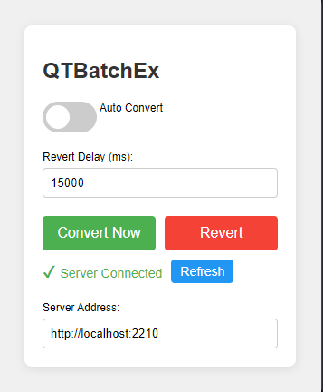

# QTBatchEx - Quick Translator Batch Extension

QTBatchEx is a Chrome extension that detects Chinese text on webpages and converts it to Sino-Vietnamese. It consists of a Chrome extension frontend and a Python backend for text processing and translation.



## Project Structure

The project is organized as follows:

```
QTBatchExtension/
├── QuickTranslator.py
├── ReplaceChar.py
├── server.py
├── models/
│   └── trie.py
├── QTBatchEx/
│   ├── background.js
│   ├── content.js
│   ├── icon16.png
│   ├── icon48.png
│   ├── icon64.png
│   ├── icon128.png
│   ├── manifest.json
│   ├── popup.html
│   └── popup.js
├── Dockerfile
├── docker-compose.yml
├── requirements.txt
├── .dockerignore
└── .github/
    └── workflows/
        └── docker-build-push.yml
```

## Components

### Chrome Extension (QTBatchEx)

The Chrome extension is responsible for detecting Chinese text on webpages and sending it to the backend for translation. It consists of the following files:

- `manifest.json`: Configuration file for the Chrome extension
- `background.js`: Background script for the extension
- `content.js`: Content script that interacts with web pages
- `popup.html` and `popup.js`: User interface for the extension
- Various icon files (icon16.png, icon48.png, icon64.png, icon128.png)

### Python Backend

The Python backend handles the translation of Chinese text to Sino-Vietnamese. It includes the following main components:

- `QuickTranslator.py`: Main script for text translation
- `ReplaceChar.py`: Handles special character replacements
- `server.py`: Server script to handle requests from the Chrome extension
- `models/trie.py`: Implementation of a Trie data structure for efficient text processing

### Data Files (Not included in repository)

The project requires several data files for translation and text processing:

- `ChinesePhienAmWords.txt`: Chinese to Sino-Vietnamese word mappings
- `Names.txt`: Name translations
- `VietPhrase.txt`: Vietnamese phrases and translations

These files should be placed in a `data` directory when running the Docker container.

## Features

- Detects Chinese text on webpages
- Converts Chinese text to Sino-Vietnamese
- Handles special characters and names
- Efficient text processing using Trie data structures
- Supports batch processing of large texts
- Dynamically translates content as it updates (e.g., in chat applications or live-updating websites)

## Installation

### Option 1: Docker Installation (Recommended)

1. Pull the Docker image from Docker Hub:
   ```
   docker pull yourusername/qtbatchex:latest
   ```

2. Create a `data` directory in the same location as your docker-compose.yml file and place the required text files (ChinesePhienAmWords.txt, Names.txt, VietPhrase.txt) in it.

3. Run the Docker container:
   ```
   docker-compose up -d
   ```

   This will start the server on port 2210.

4. Install the Chrome extension:
   - Open Chrome and go to `chrome://extensions/`
   - Enable "Developer mode"
   - Click "Load unpacked" and select the `QTBatchEx` folder

### Option 2: Local Installation

1. Clone the repository:
   ```
   git clone https://github.com/your-username/QTBatchExtension.git
   ```

2. Install the Chrome extension as described in Option 1, step 4.

3. Set up the Python backend:
   - Ensure you have Python 3.x installed
   - Install required dependencies:
     ```
     pip install -r requirements.txt
     ```
   - Create a `data` directory in the project root and place the required text files in it
   - Run the server script:
     ```
     python server.py
     ```

## Usage

1. Click on the QTBatchEx icon in your Chrome browser
2. Navigate to a webpage with Chinese text
3. The extension will automatically detect and translate the text to Sino-Vietnamese
4. For dynamically updating content (e.g., chat applications):
   - The extension will continuously monitor for new Chinese text
   - New content will be automatically translated as it appears

## Development

To modify or extend the project:

1. Edit the Chrome extension files in the `QTBatchEx` folder
2. Modify the Python backend scripts as needed
3. Update data files in the `data` directory to improve translation quality

If you're using Docker for development:
1. Make changes to the code
2. Rebuild the Docker image:
   ```
   docker build -t yourusername/qtbatchex:latest .
   ```
3. Push the image to Docker Hub:
   ```
   docker push yourusername/qtbatchex:latest
   ```

### GitHub Actions

This project uses GitHub Actions to automatically build and push the Docker image to Docker Hub when changes are pushed to the main branch. To set up GitHub Actions for your fork:

1. Fork this repository
2. Go to your fork's Settings > Secrets and variables > Actions
3. Add the following secrets:
   - `DOCKERHUB_USERNAME`: Your Docker Hub username
   - `DOCKERHUB_TOKEN`: Your Docker Hub access token (create one in Docker Hub account settings)
4. Push changes to the main branch, and GitHub Actions will automatically build and push the Docker image

## Contributing

Contributions are welcome! Please feel free to submit a Pull Request.

1. Fork the project
2. Create your feature branch (`git checkout -b feature/AmazingFeature`)
3. Commit your changes (`git commit -m 'Add some AmazingFeature'`)
4. Push to the branch (`git push origin feature/AmazingFeature`)
5. Open a Pull Request

## License

This project is licensed under the MIT License - see the [LICENSE](LICENSE) file for details.

## Acknowledgements

- [Trie data structure](https://en.wikipedia.org/wiki/Trie) for efficient text processing
- [Chrome Extension API](https://developer.chrome.com/docs/extensions/) for browser integration
- [MutationObserver API](https://developer.mozilla.org/en-US/docs/Web/API/MutationObserver) for handling dynamic content
- [Docker](https://www.docker.com/) for containerization and easy deployment
- [GitHub Actions](https://github.com/features/actions) for CI/CD
- All contributors who have helped to improve this project
